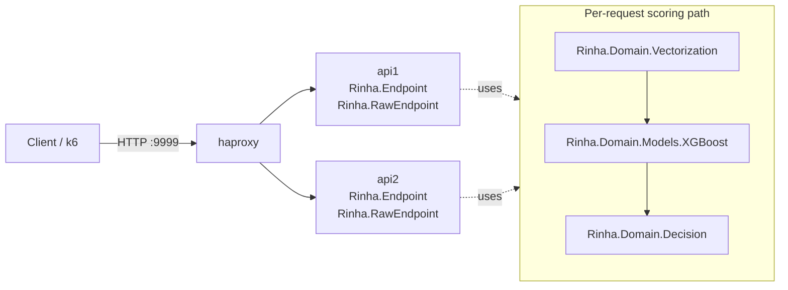

# Rinha de Backend 2026 - Elixir

Real-time fraud-detection API submission for [Rinha de Backend 2026](https://github.com/zanfranceschi/rinha-de-backend-2026).

## What This Actually Runs

- Two API BEAM nodes (`api1`, `api2`) behind HAProxy (`haproxy`).
- API hot-path is `Rinha.RawEndpoint` for `POST /fraud-score`.
- Scoring pipeline is domain-first and correctness-first:
  1. `Rinha.Domain.Vectorization.transform/1`
  2. `Rinha.Domain.Models.XGBoost.score/1`
  3. `Rinha.Domain.Decision.response_for/1`

## Correctness Rules

- Vectorization follows the official 14-dimension rules from `DETECTION_RULES.md`.
- Runtime vectors are scaled to 16 signed lanes (`s16`); lanes `14` and `15` are zero pads.
- Decision uses the exported XGBoost model in `priv/model.json`.

## Architecture

Current code is organized by layers under `lib/rinha/`:

- `domain/` - business rules and use-cases
- `adapters/` - HTTP boundaries
- `infrastructure/` - concrete implementations (cache/index/models)
- `runtime/` - OTP application wiring

Detailed boundaries and dependency rules are documented in `docs/architecture.md`.

### Runtime Topology



## Request Flow

1. HAProxy receives `POST /fraud-score` on `:9999`.
2. HAProxy forwards request to one API node (`api1` or `api2`).
3. API node decodes payload in `Rinha.RawEndpoint` and executes domain scoring.
4. Response JSON is returned through HAProxy back to client.

For direct API mode (single node), `Rinha.RawEndpoint` handles `POST /fraud-score` locally.

## Scoring and Infrastructure Map

The active scoring chain is:

`Rinha.RawEndpoint` -> `Rinha.Domain.Fraud` -> `Rinha.Domain.Vectorization` -> `Rinha.Domain.Models.XGBoost` -> `Rinha.Domain.Decision`

What each infrastructure module does:

- `Rinha.XGBoostStore`: loads compact XGBoost tree ensemble binaries for the scorer.
- `Rinha.Resources`: loads normalization constants and MCC risk map.

Important: bloom filter, neural network scoring, and KNN scoring are not part of the active runtime path.

## Cluster and Health Endpoints

- Public readiness via HAProxy: `GET /ready` (on `:9999`).
- API debug routes (non-prod builds):
  - `GET /debug/ready`
  - `GET /debug/profile`
  - `POST /debug/profile/reset`
  - `GET /debug/fixtures`
  - `GET /debug/fixtures/:name`
  - `POST /debug/score`
  - `POST /debug/simulate`

## Telemetry and Profiling

Profiler module: `Rinha.Profiler`.

Tracked telemetry metrics:

- profiler summaries exposed by `Rinha.Profiler` (see `/debug/profile`)

Two ways to read telemetry:

1. Pull snapshot: `GET /debug/profile`
2. Periodic logs: enabled by default every `10s`

Runtime env var:

- `TELEMETRY_LOG_INTERVAL_MS`
  - positive integer = interval in ms
  - `0`, `off`, `OFF` = disable periodic telemetry logs

## Runtime Data and Limits

- Official reference dataset: `resources/references.json.gz` (~48 MB compressed)
- XGBoost model file: `priv/model.json`
- Resource envelope in `docker-compose.yml`:
  - `api1`: `0.45 CPU`, `125 MB`
  - `api2`: `0.45 CPU`, `125 MB`
  - `haproxy`: `0.10 CPU`, `100 MB`
  - total: `1.00 CPU`, `350 MB`

## Model Training

Train/export the runtime model:

```bash
make train
```

## Data Files

Reference files shipped in this repo:

- `resources/references.json.gz`
- `resources/normalization.json`
- `resources/mcc_risk.json`
- `resources/example-payloads.json`
- `resources/example-references.json`

At build time, `resources/references.json.gz` is copied into `priv/resources/` so runtime startup can validate that the official dataset is present.

Runtime env vars:

- `XGBOOST_PATH`: optional override for the exported XGBoost model file.

## Quickstart

Requirements: `mix`, `docker`, `k6`.

```bash
# Single instance dev server (:4000)
make run

# Basic debug checks
make debug-ready
make debug-fixtures
FIXTURE=legit make debug-score

# Profile simulation batch
make debug-profile-reset
COUNT=1000 make debug-simulate
make debug-profile

# Stack smoke via HAProxy (:9999)
make docker-test
```

## Make Targets

Current targets from `Makefile`:

- `deps`, `compile`, `test`, `train`, `run`
- `smoke`, `load`
- `debug-ready`, `debug-profile`, `debug-profile-reset`
- `debug-fixtures`, `debug-score`, `debug-simulate`
- `docker-build`, `docker-up`, `docker-down`, `docker-test`, `docker-load`
- `docker-stats`, `docker-logs`, `docker-cycle`, `clean`, `distclean`

## Aggressive Local Validation

To reduce surprises in the official run, use matrix-style load validation
against all three datasets before publishing an image tag.

Recommended sequence:

```bash
# Official-like run (3 datasets, 900 rps, 120s each)
make docker-load-official

# Aggressive burn-in (3 datasets, 1000 rps, 300s each)
make docker-load-aggressive
```

Or run both in sequence:

```bash
make docker-load-matrix
```

Result files written by these runs:

- `test/results-main.json`
- `test/results-alt1.json`
- `test/results-alt2.json`
- `test/results-main-burn.json`
- `test/results-alt1-burn.json`
- `test/results-alt2-burn.json`

These targets use `test/k6/matrix.js`, which accepts env overrides such as
`TARGET_RPS`, `HOLD_STAGE`, `PRE_ALLOCATED_VUS`, `MAX_VUS`, and
`REQ_TIMEOUT_MS` for quick stress-profile tuning.
