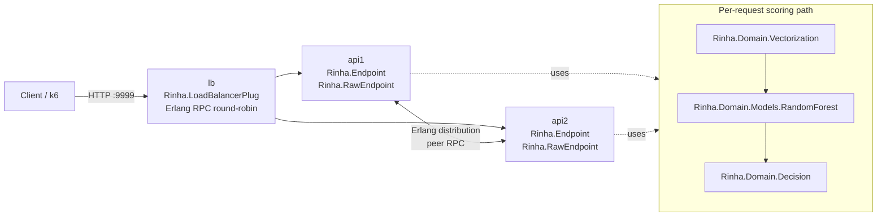

# Rinha de Backend 2026 - Elixir

Real-time fraud-detection API submission for [Rinha de Backend 2026](https://github.com/zanfranceschi/rinha-de-backend-2026).

## What This Actually Runs

- Two API BEAM nodes (`api1`, `api2`) behind an Elixir load-balancer node (`lb`).
- LB forwards HTTP requests over Erlang distribution (`:erpc`) to API nodes (not TCP proxying).
- API hot-path is `Rinha.RawEndpoint` for `POST /fraud-score`.
- Scoring pipeline is domain-first and correctness-first:
  1. `Rinha.Domain.Vectorization.transform/1`
  2. `Rinha.Domain.Models.RandomForest.score/1` (`SCORING_MODEL=xgb`, default)
  3. `Rinha.Domain.Decision.response_for/1`

## Correctness Rules

- Vectorization follows the official 14-dimension rules from `DETECTION_RULES.md`.
- Runtime vectors are quantized to 16 signed lanes (`s16`) for fast distance scans; lanes `14` and `15` are zero pads.
- Default decision uses the exported XGBoost tree ensemble in `priv/random_forest.bin`.
- KNN remains available with `SCORING_MODEL=knn` and uses `k=5` nearest neighbors over the official reference dataset.
- Decision threshold is fixed: `approved = fraud_score < 0.6`.

## Architecture

Current code is organized by layers under `lib/rinha/`:

- `domain/` - business rules and use-cases
- `adapters/` - HTTP and LB boundaries
- `infrastructure/` - concrete implementations (cache/index/models)
- `runtime/` - OTP application wiring

Detailed boundaries and dependency rules are documented in `docs/architecture.md`.

### Runtime Topology



## Request Flow

1. LB receives `POST /fraud-score` on `:9999`.
2. LB forwards request payload to selected API node with `:erpc.call/5` (`Rinha.LoadBalancerPlug`).
3. API node decodes payload in `Rinha.RawEndpoint` and executes domain scoring.
4. Response JSON is returned directly from API node through LB back to client.

For direct API mode (single node), `Rinha.RawEndpoint` handles `POST /fraud-score` locally.

## Scoring and Infrastructure Map

The active scoring chain is:

`Rinha.RawEndpoint` -> `Rinha.Domain.Fraud` -> `Rinha.Domain.Vectorization` -> `Rinha.Domain.Models.RandomForest` -> `Rinha.Domain.Decision`

What each infrastructure module does:

- `Rinha.IvfStore`: owns IVF metadata and bucket reads from `priv/ivf_index.bin` via `iommap`.
- `Rinha.IvfScanner`: picks nearest centroids and scans only those buckets.
- `Rinha.KnnScanner`: hot inner loop that computes distances and top-5 labels.
- `Rinha.RandomForestStore`: loads compact XGBoost tree ensemble binaries for the default scorer.
- `Rinha.Resources`: loads normalization constants and MCC risk map.

Important: bloom filter is not part of current runtime. Neural and KNN scorers remain optional via `SCORING_MODEL`.

## Cluster and Health Endpoints

- Public readiness via LB: `GET /ready` (on `:9999`).
- Cluster debug via LB: `GET /debug/cluster`.
- API debug routes (non-prod builds):
  - `GET /debug/ready`
  - `GET /debug/profile`
  - `POST /debug/profile/reset`
  - `GET /debug/fixtures`
  - `GET /debug/fixtures/:name`
  - `POST /debug/score`
  - `POST /debug/simulate`

## Telemetry and Profiling

Profiler module: `Rinha.Profiler`.

Tracked telemetry metrics:

- `ivf_centroid`
- `ivf_bucket`
- `ivf_total`

Two ways to read telemetry:

1. Pull snapshot: `GET /debug/profile`
2. Periodic logs: enabled by default every `10s`

Runtime env var:

- `TELEMETRY_LOG_INTERVAL_MS`
  - positive integer = interval in ms
  - `0`, `off`, `OFF` = disable periodic telemetry logs

## Runtime Data and Limits

- Official reference dataset: `resources/references.json.gz` (~48 MB compressed)
- Default XGBoost model file: `priv/random_forest.bin`
- Optional KNN indexed runtime file: `priv/ivf_index.bin`
- IVF index format: version `1`, with `k=2048`, `n=3_000_000`, `stride=16`
- Default KNN probe budget: `12` buckets (configurable via `KNN_PROBES`)
- Resource envelope in `docker-compose.yml`:
  - `api1`: `0.45 CPU`, `125 MB`
  - `api2`: `0.45 CPU`, `125 MB`
  - `lb`: `0.10 CPU`, `100 MB`
  - total: `1.00 CPU`, `350 MB`

## Index Preprocess

Generate the runtime index from the official references dataset:

```bash
# Full pipeline (references.json.gz -> priv/ivf_index.bin)
make preprocess

# Optional split steps
make preprocess-refs
make ivf-index
```

Optional parameters:

- `REFS_GZ=/path/to/references.json.gz` overrides source dataset path.
- `IVF_K=2048` number of centroids.
- `IVF_ITERS=15` k-means iterations.
- `IVF_BATCH=20000` k-means batch size.

## Data Files

Reference files shipped in this repo:

- `resources/references.json.gz`
- `resources/normalization.json`
- `resources/mcc_risk.json`
- `resources/example-payloads.json`
- `resources/example-references.json`

At build time, `resources/references.json.gz` is copied into `priv/resources/` so runtime startup can validate that the official dataset is present.

Runtime env vars:

- `REFERENCES_PATH`: optional override for the references dataset file.
- `SCORING_MODEL`: `xgb`/`random_forest` default, or `knn`, `nn`.
- `KNN_PROBES`: IVF probe budget used by `Rinha.Domain.Models.KNN` (default `12`).
- `N3_BORDERLINE_CALIBRATION`: enable/disable narrow `n=3 -> n=2` boundary calibration (default `true`; set `0|false|off` to disable).

Cluster defaults in `docker-compose.yml`:

- `SCORING_MODEL` defaults to `xgb`.
- To run KNN locally, override on demand:
  - `SCORING_MODEL=knn KNN_PROBES=64 N3_BORDERLINE_CALIBRATION=true make docker-cycle`

IVF index I/O backend:

- Runtime uses `iommap` only (no `:file.pread` fallback path in the scorer).

## Quickstart

Requirements: `mix`, `docker`, `k6`.

```bash
# Single instance dev server (:4000)
make run

# Basic debug checks
make debug-ready
make debug-fixtures
FIXTURE=legit make debug-score

# Profile simulation batch
make debug-profile-reset
COUNT=1000 make debug-simulate
make debug-profile

# Cluster smoke via LB (:9999)
make docker-test
```

## Make Targets

Current targets from `Makefile`:

- `deps`, `compile`, `test`, `preprocess`, `preprocess-refs`, `ivf-index`, `run`
- `smoke`, `load`
- `debug-ready`, `debug-profile`, `debug-profile-reset`
- `debug-fixtures`, `debug-score`, `debug-simulate`, `debug-cluster`
- `docker-build`, `docker-up`, `docker-down`, `docker-test`, `docker-load`
- `docker-stats`, `docker-logs`, `docker-cycle`, `clean`, `distclean`

## Aggressive Local Validation

To reduce surprises in the official run, use matrix-style load validation
against all three datasets before publishing an image tag.

Recommended sequence:

```bash
# Official-like run (3 datasets, 900 rps, 120s each)
make docker-load-official

# Aggressive burn-in (3 datasets, 1000 rps, 300s each)
make docker-load-aggressive
```

Or run both in sequence:

```bash
make docker-load-matrix
```

Result files written by these runs:

- `test/results-main.json`
- `test/results-alt1.json`
- `test/results-alt2.json`
- `test/results-main-burn.json`
- `test/results-alt1-burn.json`
- `test/results-alt2-burn.json`

These targets use `test/k6/matrix.js`, which accepts env overrides such as
`TARGET_RPS`, `HOLD_STAGE`, `PRE_ALLOCATED_VUS`, `MAX_VUS`, and
`REQ_TIMEOUT_MS` for quick stress-profile tuning.
