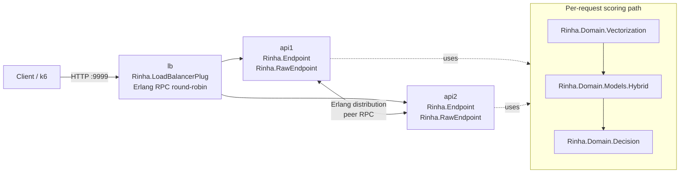

# Rinha de Backend 2026 - Elixir

Real-time fraud-detection API submission for [Rinha de Backend 2026](https://github.com/zanfranceschi/rinha-de-backend-2026).

## What This Actually Runs

- Two API BEAM nodes (`api1`, `api2`) behind an Elixir load-balancer node (`lb`).
- LB forwards HTTP requests over Erlang distribution (`:erpc`) to API nodes (not TCP proxying).
- API hot-path is `Rinha.RawEndpoint` for `POST /fraud-score`.
- Scoring pipeline is domain-first:
  1. `Rinha.Domain.Vectorization.transform/1`
  2. `Rinha.Domain.Models.Hybrid.score/1`
  3. `Rinha.Domain.Decision.response_for/1`

## Architecture

Current code is organized by layers under `lib/rinha/`:

- `domain/` - business rules and use-cases
- `adapters/` - HTTP and LB boundaries
- `infrastructure/` - concrete implementations (cache/index/models)
- `runtime/` - OTP application wiring

Detailed boundaries and dependency rules are documented in `docs/architecture.md`.

### Runtime Topology



## Request Flow

1. LB receives `POST /fraud-score` on `:9999`.
2. LB forwards request payload to selected API node with `:erpc.call/5` (`Rinha.LoadBalancerPlug`).
3. API node decodes payload in `Rinha.RawEndpoint` and executes domain scoring.
4. Response JSON is returned directly from API node through LB back to client.

For direct API mode (single node), `Rinha.RawEndpoint` handles `POST /fraud-score` locally.

## Cluster and Health Endpoints

- Public readiness via LB: `GET /ready` (on `:9999`).
- Cluster debug via LB: `GET /debug/cluster`.
- API debug routes (non-prod builds):
  - `GET /debug/ready`
  - `GET /debug/profile`
  - `POST /debug/profile/reset`
  - `GET /debug/fixtures`
  - `GET /debug/fixtures/:name`
  - `POST /debug/score`
  - `POST /debug/simulate`

## Telemetry and Profiling

Profiler module: `Rinha.Profiler`.

Tracked telemetry metrics:

- `ivf_centroid`
- `ivf_bucket`
- `ivf_total`
- `neural_total`

Two ways to read telemetry:

1. Pull snapshot: `GET /debug/profile`
2. Periodic logs: enabled by default every `10s`

Runtime env var:

- `TELEMETRY_LOG_INTERVAL_MS`
  - positive integer = interval in ms
  - `0`, `off`, `OFF` = disable periodic telemetry logs

## Runtime Data and Limits

- IVF index format: version `1`
- IVF runtime parameters: `k=2048`, `n=3_000_000`, `stride=16`
- Resource envelope in `docker-compose.yml`:
  - `api1`: `0.45 CPU`, `125 MB`
  - `api2`: `0.45 CPU`, `125 MB`
  - `lb`: `0.10 CPU`, `100 MB`
  - total: `1.00 CPU`, `350 MB`

## Quickstart

Requirements: `mix`, `docker`, `k6`.

```bash
# Single instance dev server (:4000)
make run

# Basic debug checks
make debug-ready
make debug-fixtures
FIXTURE=legit make debug-score

# Profile simulation batch
make debug-profile-reset
COUNT=1000 make debug-simulate
make debug-profile

# Cluster smoke via LB (:9999)
make docker-test
```

## Make Targets

Current targets from `Makefile`:

- `deps`, `compile`, `test`, `run`
- `smoke`, `load`
- `debug-ready`, `debug-profile`, `debug-profile-reset`
- `debug-fixtures`, `debug-score`, `debug-simulate`, `debug-cluster`
- `docker-build`, `docker-up`, `docker-down`, `docker-test`, `docker-load`
- `docker-stats`, `docker-logs`, `docker-cycle`, `clean`
