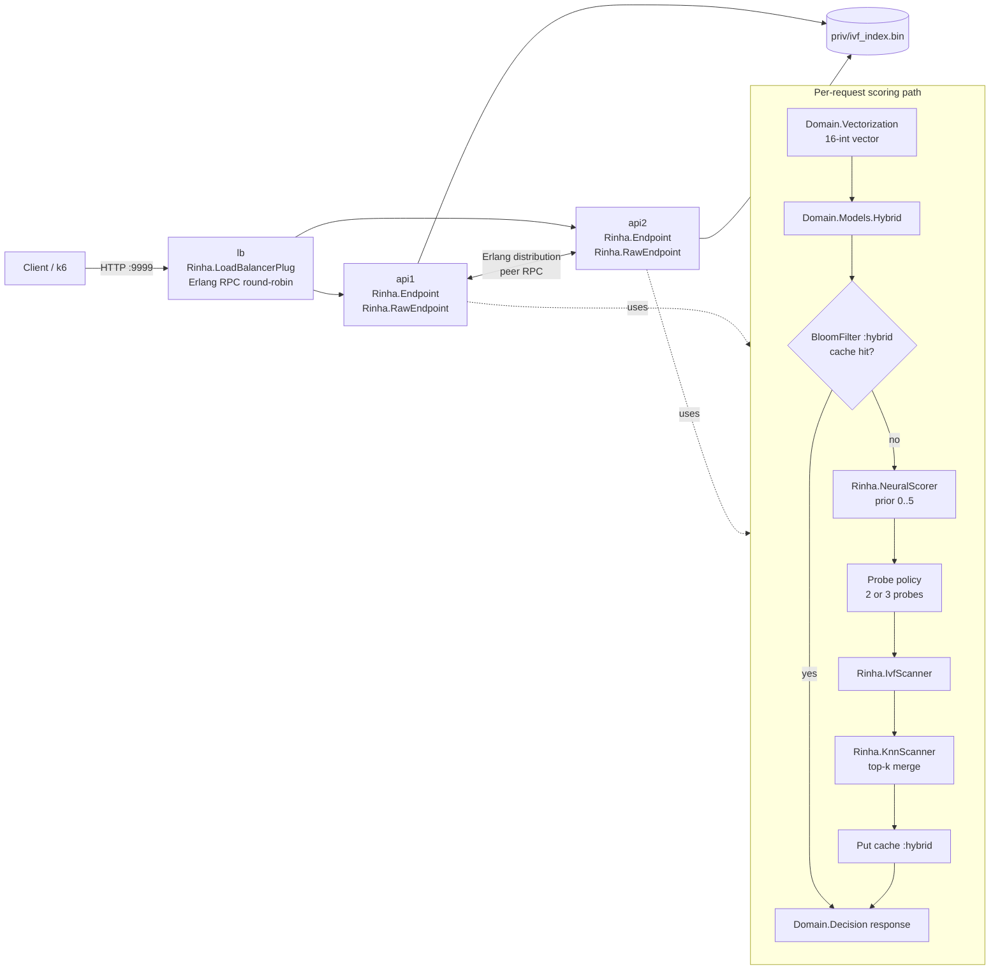

# Rinha de Backend 2026 - Elixir

Real-time fraud-detection API submission for [Rinha de Backend 2026](https://github.com/zanfranceschi/rinha-de-backend-2026).

Current runtime is a hybrid scorer in pure Elixir:

- Bloom-filter + ETS cache (`Rinha.BloomFilter`) with namespaces (`:neural`, `:ivf`, `:hybrid`)
- neural prior (`Rinha.NeuralScorer`) to choose IVF probe budget
- IVF vector search (`Rinha.IvfScanner` + `Rinha.KnnScanner`) for final decision
- two API nodes behind a pure-Elixir Erlang-distribution load balancer

## Stack

- Elixir/Phoenix app with a hot-path Plug (`Rinha.RawEndpoint`) for `POST /fraud-score`
- Pure-Elixir neural inference + IVF KNN search (no NIF dependency in hot path)
- Erlang distribution between `api1` and `api2` (`Rinha.ClusterConnector`)
- Persistent in-memory metadata plus on-demand IVF bucket reads from `priv/ivf_index.bin`
- Docker Compose topology: `api1`, `api2`, `lb`

## Architecture (Mermaid)



## Runtime data and limits

- IVF index format: version `1`
- IVF parameters loaded at runtime: `k=2048`, `n=3_000_000`, `stride=16`
- Resource envelope in `docker-compose.yml`:
  - `api1`: `0.45 CPU`, `125 MB`
  - `api2`: `0.45 CPU`, `125 MB`
  - `lb`: `0.10 CPU`, `100 MB`
  - Total: `1.00 CPU`, `350 MB`

## Request flow

1. `Rinha.RawEndpoint` handles `POST /fraud-score` directly.
2. Payload is transformed by `Rinha.Domain.Vectorization.transform/1`.
3. `Rinha.Domain.Models.Hybrid.score/1` checks Bloom/ETS cache for `:hybrid`.
4. On miss, neural prior is computed and mapped to probe count (`2` or `3`).
5. `Rinha.IvfScanner.score/2` selects top centroids and scans probed buckets.
6. `Rinha.Domain.Decision.response_for/1` returns final JSON (`approved`, `fraud_score`).

## Debug and profiling endpoints

Debug routes are available in non-prod builds via `Rinha.DebugRouter`:

- `GET /debug/ready`
- `GET /debug/profile`
- `POST /debug/profile/reset`
- `GET /debug/fixtures`
- `GET /debug/fixtures/:name`
- `POST /debug/score`
- `POST /debug/simulate`

Profiler (`Rinha.Profiler`) tracks telemetry histograms for:

- `ivf_centroid`
- `ivf_bucket`
- `ivf_total`
- `neural_total`

Note: profile counters are populated by scoring paths that emit telemetry (for example `debug-simulate`).

## Quickstart

Requirements: `mix`, `docker`, `k6`.

```bash
# Dev server (single instance on :4000)
make run

# Basic checks
make debug-ready
make debug-fixtures
FIXTURE=legit make debug-score

# Profile one batch
make debug-profile-reset
COUNT=1000 make debug-simulate
make debug-profile

# Cluster smoke
make docker-test
```

## Make targets

Current targets from `Makefile`:

- `deps`, `compile`, `test`, `run`
- `smoke`, `load`
- `debug-ready`, `debug-profile`, `debug-profile-reset`
- `debug-fixtures`, `debug-score`, `debug-simulate`
- `docker-build`, `docker-up`, `docker-down`, `docker-test`, `docker-load`
- `docker-stats`, `docker-logs`, `docker-cycle`, `clean`

## Recent local profile snapshot

Example (`COUNT=10000`, `WARMUP=0` via `make debug-simulate`):

- throughput: `~2481 req/s`
- latency p50/p95/p99 (us): total `364/577/711`
- profiler means (us):
  - `ivf_total`: `379`
  - `ivf_bucket`: `312`
  - `ivf_centroid`: `66`
  - `neural_total`: `2`

This indicates the primary optimization surface is IVF bucket scanning.
